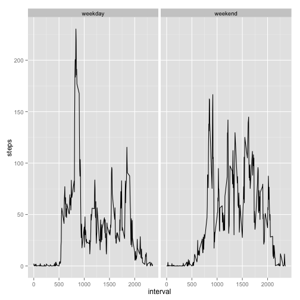

Reproducible Research Peer Assesment 1
========================================================
## Loading and Preprocessing the data

First read in the files and get the total number of steps per day: 


```r
library(plyr)
library(reshape2)
library(ggplot2)

unzip("activity.zip")
act <- read.csv("activity.csv")

totalSteps <- tapply(act$steps, act$date, FUN = sum)
totalSteps <- melt(totalSteps)
names(totalSteps) <- c("date", "totalSteps")
```


###Calculating the mean total number of steps per day

Part one of the assignment
1. Make a histogram of the total number of steps 
2. Calculate the mean and median of the total number of steps per day - The median is *10765* and the mean is *10766*. See code below. The summary() functions reports both mean and median. 


```r
ggplot(totalSteps, aes(x = totalSteps) ) + geom_bar() + labs(title = "Histogram of total number of steps per day")
```

```
## stat_bin: binwidth defaulted to range/30. Use 'binwidth = x' to adjust this.
```

 

```r
summary(totalSteps)
```

```
##          date      totalSteps   
##  2012-10-01: 1   Min.   :   41  
##  2012-10-02: 1   1st Qu.: 8841  
##  2012-10-03: 1   Median :10765  
##  2012-10-04: 1   Mean   :10766  
##  2012-10-05: 1   3rd Qu.:13294  
##  2012-10-06: 1   Max.   :21194  
##  (Other)   :55   NA's   :8
```
 

###What is the average daily activity pattern? 

Reaggregate the data using the reshape package to summarize the data by interval and plot with the ggplot package because it makes prettier plots than base R. 
1. Code to generate plot time seres plot is below. 

```r
m.act <- melt(act, measure = "steps", id = c("date", "interval"), na.rm = TRUE)
byInt <- dcast(m.act, interval ~ variable, fun = mean)
ggplot(byInt, aes(x = interval, y = steps)) + geom_line()
```

 

2. The interval in which steps has the max value of **206.1698** is at **835**. The code below finds the max values and then displays the row containing the max value of steps. 


```r
maxId = which(byInt$steps == max(byInt$steps))
byInt[maxId,]
```

```
##     interval steps
## 104      835 206.2
```

###Imputing missing values 

1. There are **2304 missing values**, as caluclated below.

```r
nas = act$steps[is.na(act$steps)]
length(nas)
```

```
## [1] 2304
```
2. The strategy I took to impute missing values is to take the average for each time interval and replace this missing value using the ave() function 
3. The new dataset is act2

```r
act2 <- act
act2 <- transform(act2, 
            steps = ifelse(is.na(steps),
            ave(steps, interval, FUN = function(x) mean(x, na.rm = TRUE)),  steps))
```
4. Histogram of the total values with the new data  (again using ggplot because it makes nicer plots)


```r
totalSteps2 <- tapply(act2$steps, act2$date, FUN = sum)
totalSteps2 <- melt(totalSteps2)
names(totalSteps2) <- c("date", "totalSteps")
#this is the same as for non-imputed values
ggplot(totalSteps2, aes(x = totalSteps) ) + geom_bar() + labs(title = "Histogram of total number of steps per day")
```

```
## stat_bin: binwidth defaulted to range/30. Use 'binwidth = x' to adjust this.
```

 

```r
summary(totalSteps2)
```

```
##          date      totalSteps   
##  2012-10-01: 1   Min.   :   41  
##  2012-10-02: 1   1st Qu.: 9819  
##  2012-10-03: 1   Median :10766  
##  2012-10-04: 1   Mean   :10766  
##  2012-10-05: 1   3rd Qu.:12811  
##  2012-10-06: 1   Max.   :21194  
##  (Other)   :55
```

If you comapre mean and median before and after imputing missing values, **only the median changed, and only by 1**. 

###Comparing Weekdays to weekends 
1. New variable for weekday vs. weekend is called wkOrwkend, and I used an ifelse statement to determine if a day fell on a weekday or weekend.


```r
act2$date <- as.Date(act2$date)
act2$day = weekdays(act2$date)
act2$wkOrwkend = ifelse(!(act2$day %in% c("Saturday", "Sunday")), "weekday", "weekend")
```
2. Plot, using ggplot, using same reshape strategy as above to average accross time intervals. 


```r
m.act2 <- melt(act2, measure = "steps", id = c("date", "interval", "wkOrwkend"), na.rm = TRUE)
byInt2 <- dcast(m.act2, interval + wkOrwkend ~ variable, fun = mean)
ggplot(byInt2, aes(x= interval, y= steps )) + geom_line() + facet_grid(~wkOrwkend)
```

 
